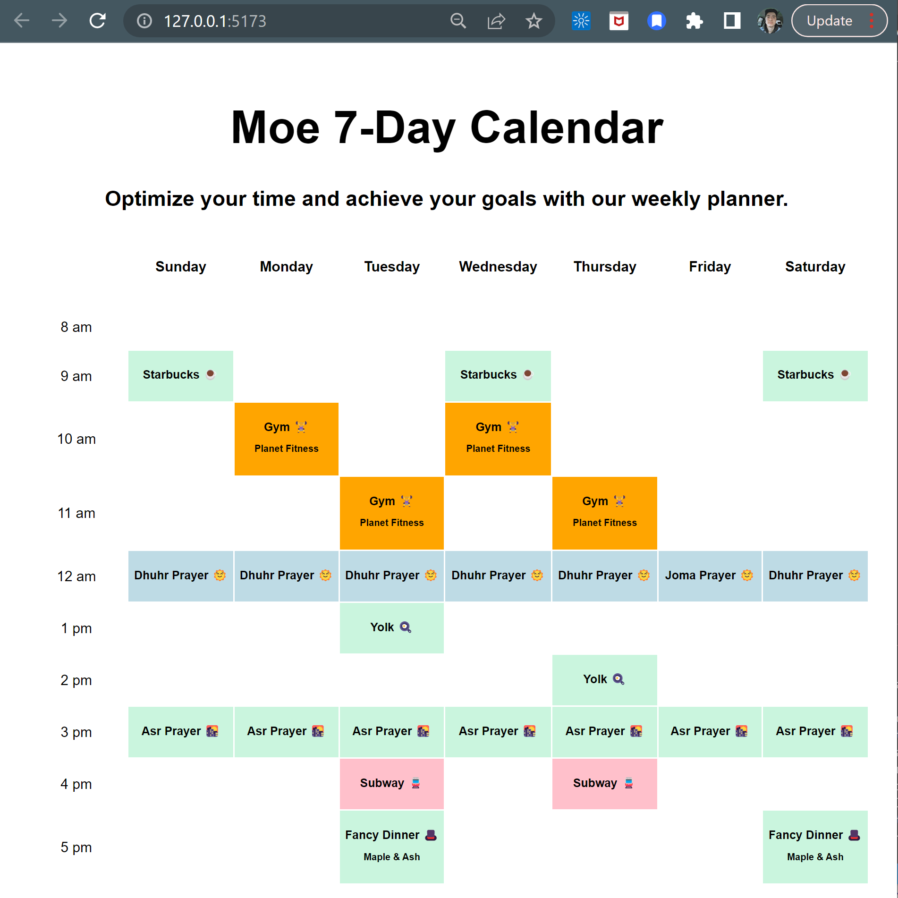

# 7-Day-Calendar
Used react and viteto build a calendar representing the days of week.

# Description
In this project, I built a grid-style calendar with one-hour events that plan out a single week. 

# App Features
- A one-week calendar that includes one-hour time blocks
- Events have different titles
- Events have different colors based on their type
- Some events include location

# Resulted Calender
